# Design and Architecture of _Chirp!_

## Domain model
The four images below show our domain model. The fourth picture shows the entire domain model, while the first three images are cuts of the fourth, this is done so that it is easier for the reader to see the content of the domain model. Next to the arrows, that go out of the image, there is a name which depicts the class or interface that is on the other side of the arrow. 

#### Core:
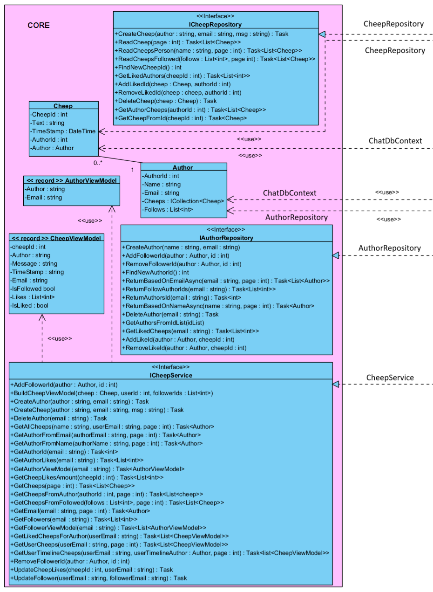

#### Infrastructure and ASPNETCORE Identity

#### Web
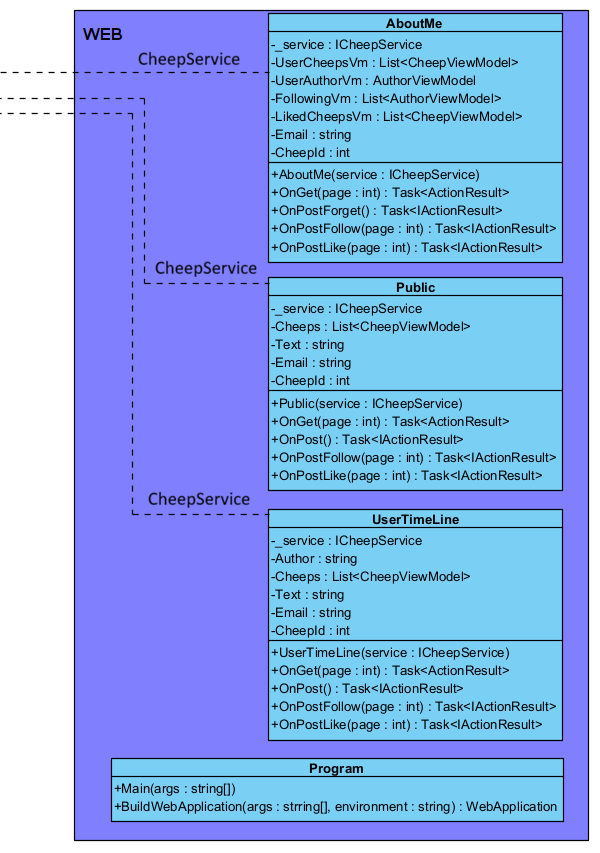

#### Full Domain Model
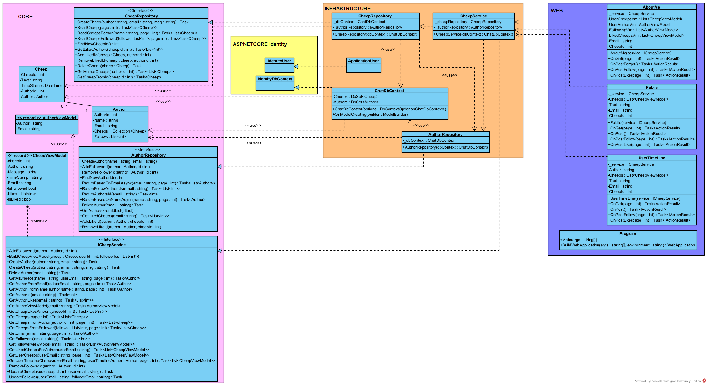

## Architecture — In the small

Our application architecture is based on the Onion Skin layer architecture. Each layer is only coupled with its inner layer, thus allowing for a high level of decoupling.

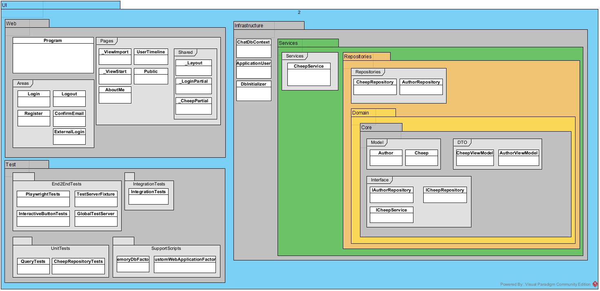

We made sure to keep our architecture clean and avoid redundancy. The model may have some inconsistencies but it accurately represents our application.

| Object Type | Description | Visual |
| -------- | -------- | -------- |
| Onion Layer     | Coloured Package Box    | 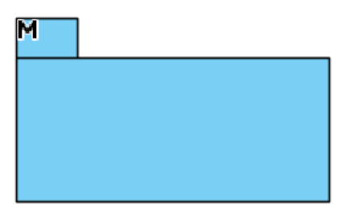 |
| Project | Dark Grey Package Box |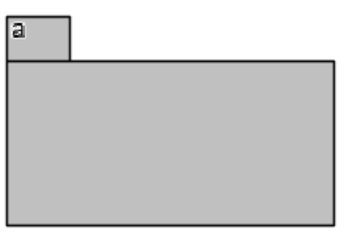 |
| Folder | Light Grey Box | 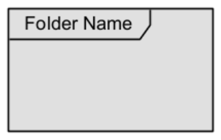 |
| Class | White Class Box | 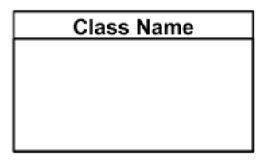 |

## Architecture of deployed application
The deployed application takes HTTPS request from a user, and establishes a connection with the user. With this connection, they can now interact with the website. (We could not find a cylinder for the DB)

## User activities
Below are two activity diagrams for our Chirp application. The first diagram shows if the user is logged out and the other shows if the user is logged in.

#### Unauthenticated user
Users can view the *public timeline*, *login* page and *register* page. They can be accessed at all times. User timeline of other users can also be accessed in the public timeline. On the *register* page you can register with either email or GitHub.

#### Authenticated user
Users can view the *public timeline*, *my timeline*, *logout* button and *about me* page. They can be accessed at all times. Users can *follow/unfollow* other users and *like/unlike* theirs and your own post in every timeline. Users can *post* a cheep on the public timeline and their own timeline. Users can also click the *forget me* button on their *about me* page and delete themselves.

## Sequence of functionality/calls trough _Chirp!_
Whenever a client opens up the website, via a HTTP request, the Chirp application will immediatly call upon a function that travels through the system to query all Cheeps and then returns the List of Cheeps back to the Public Page as the HTTP finishes a response to the client. 
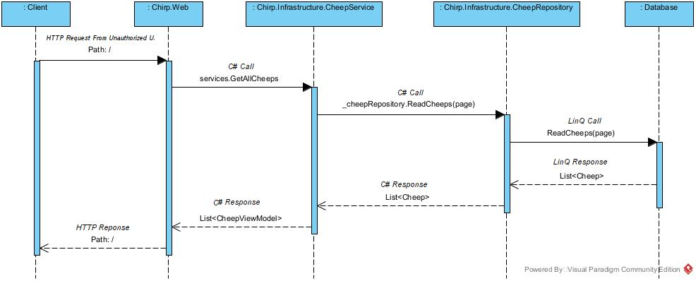

# Process

## Build, test, release, and deployment

Our program contains the following github workflows.

* **Build and test:** Builds and test the program. it's triggered on push and pull requests on any branch.

* **Verify and publish:** Builds and tests the application, afterwards it makes a published version. It's triggered on pushes with a new version tag.

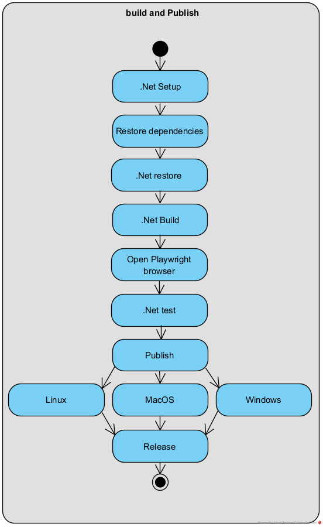

* **Deploy to Azure:** It builds, tests and deploys the application to Azure. Triggered on every push to master branch. 

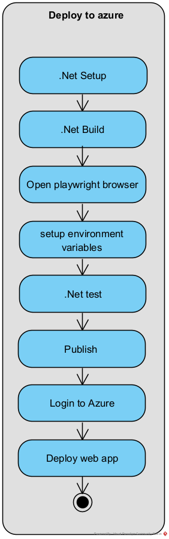

## Team work

The picture below shows the project board on the 19th of December 2025. All issues have been completed.

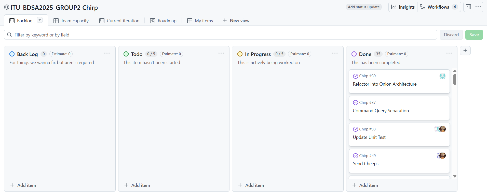

Each time a new requirement for the project was found, an issue was made to describe it. The issue would then be analysed and team members would be assigned to work on it. A new branch was made for the new requirements to be worked on. Some issues would be assigned to the same branch, to make it easier to integrate them together. Members worked together using primarily pair programming. They would make a commit to the branch whenever necessary.

When the issue was done, a pull request would be made. A team member that had not worked on the issue would then review it, and if it was approved, the branch would be merged into the master branch. The issue would then be marked as done in the project board.

## How to make _Chirp!_ work locally

To download and run the program locally you have to do the following steps. 

1. First go to the following website https://github.com/ITU-BDSA2025-GROUP2/Chirp
2. Click the button "code" 
3. In the submenu it opens, copy the url.

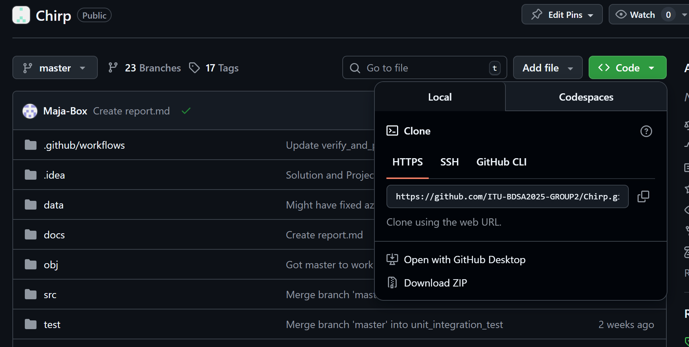

4. Open your prefered terminal.
5. Type ``git clone <url>``
6. Next type `cd Chirp`
7. Next type `cd src/Web`
8. Next run the following command. `dotnet run`
9. The terminal will show you that a localhost has opened. 
10. In the terminal press the link or open a browser and copy the url from the terminal.

    
11. If your url is not `127.0.0.1:<your port>` please change it to that if you want to log in with GitHub.
12. Now you should be able to interact with the webpage 

## How to run test suite locally
To run the test suite of the program locally, you have to do the following steps. 

* You need to be able to run powershell commands in the terminal, if you cannot, please make sure to install it.
    
1. Follow the steps 1 to 6 found in the previous section to clone the repository.
2. Open the program, you should then be in the "Chirp" folder in the terminal.
3. Navigate to the End2EndTests folder by running `cd test/End2EndTests` in the terminal.
4. Run the command `pwsh bin/Debug/net8.0/playwright.ps1 install --with-deps` in the terminal.
5. Navigate back to the Chirp folder by running `cd ../..` in the terminal.
6. Run the command `dotnet test` in the terminal.
7. You should now be able to see the tests be run. Some tests will open a web browser to run, please do not close them, they will automaticaly disappear when the test has finished running.

# Ethics

## License
Our project uses the Apache 2.0 license. This license was chosen because it was the most permissive license we could have, while respecting the licenses of all the packages and imports used in the project.

## LLMs, ChatGPT, CoPilot, and others

Yes LLMs were used during the project. Our used  chatbots include ChatGPT, Grok and Claude. Chatbots were used as a sparing partner, or to find a specific part like a function in a bigger library documentation. Chatbots have also been used in a few cases where the solution was really good and was copied. Every time that happened, the respective chatbot has been credited with a GitHub co-author.