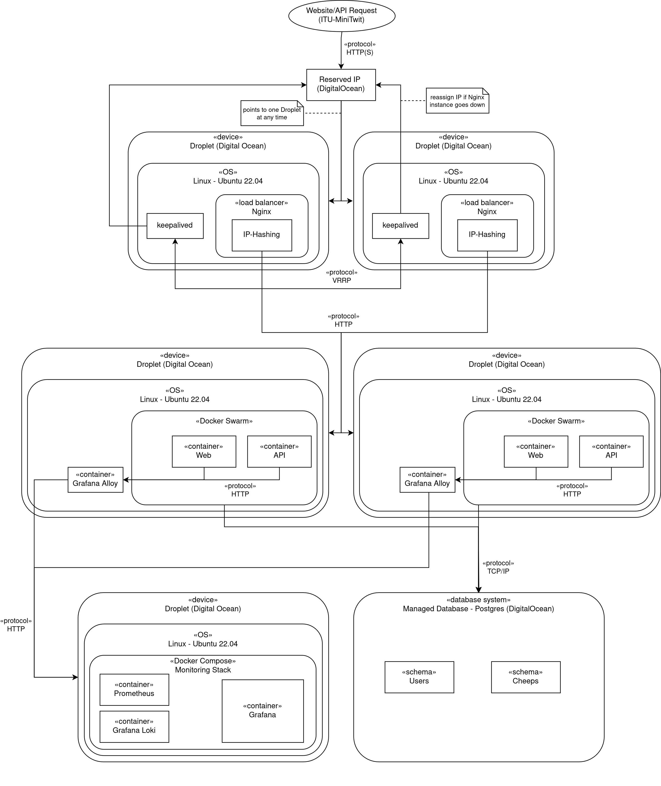
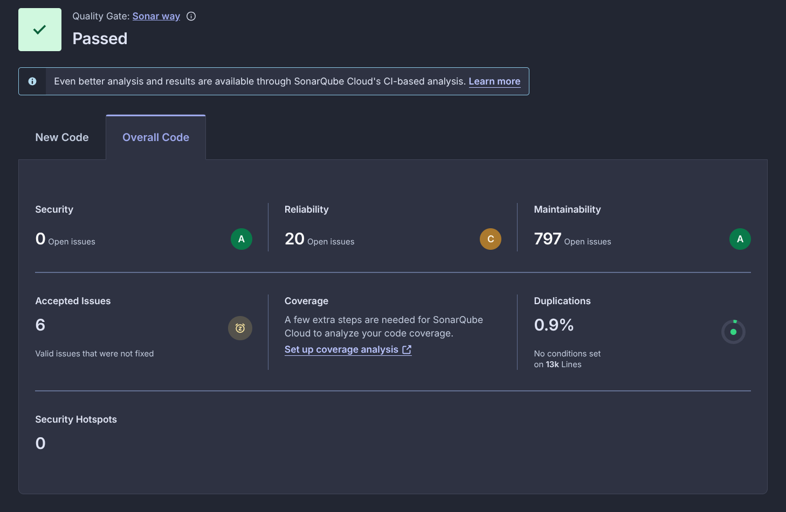

## **System's perspective**

### Design and Architecture - Anton & Oriol
Our system consists of the following.

| Component        | Count | Technologies                             |
|------------------|-------|------------------------------------------|
| Reserved IP      | 1     | DigitalOcean Reserved IP                 |
| Load Balancers   | 2     | Droplet & nginx                          |
| Web + API        | 2     | Droplet, Docker, Grafana Alloy           |
| Monitoring       | 1     | Droplet, Loki, Prometheus & Grafana      |
| Managed Database | 1     | Digitalocean Managed Database (Postgres) |

#### Reserved IP Address
A single reserved IP Address serves as a stable public entrypoint for all inbound traffic. It is statically assigned and does not change regardless of infrastructure state. At any given time, the reserved IP is mapped to one of the two load balancer nodes. If a load balancer goes down, the IP will remap to the second load balancer, ensuring continual service.

#### Load Balancer
Two load balancer nodes on DigitalOcean Droplets running Nginx. Both nodes are keepalived, which continuously monitors the health of the active node and orchestrates the reassignment of the reserved IP to the secondary node if failure is detected. Each load balancer functions as a reverse proxy. Incoming requests are forwarded to any of the Web/Api Servers depending on the IP-Hashing.

#### Web and API Servers
Two droplets serve as the application layer, each running two replicas of both the Web- and the API Images, meaning our system maintains a total of four concurrent instances of each service, providing redundancy and enabling load distribution across both nodes. Additionally, each Web & API server runs Grafana Alloy, which is responsible for collecting and forwarding logs and metrics to our centralised monitoring server.

#### Monitoring Server
A dedicated droplet hosts the monitoring stack, which centralises the collection and storage of logs and metrics data from the applications.

#### Managed Database
Application data is persisted in a DigitalOcean Managed Database running PostgreSQL. Both Web and API server instances are connected to the shared database.

### Dependencies - Karam & Oriol 

#### Codebase
Our codebase has a significant number of package dependencies that it relies on. These are the most relevant ones:

* Microsoft.Playwright 
  * Xunit 
  * NUnit
* Npsql.EntityFrameworkCore.PostgreSQL
* EFCore
* OpenTelemetry.Exporter
  * OpenTelemetryProtocol
  * Prometheus.HttpListener
* Swashbuckle.AspNetCore 
  * Annotations
  Newtonsoft
  SwaggerUI
* Xunit 
* NUnit

Additional dependencies can be found in the [dependencies.md ](dependencies.md) file.

#### CI/CD
The CI/CD pipeline makes use of a wide arrange of tools:

* Infrastructure as code
  - OpenTofu: creates the cloud resources 
  - Ansible: installs and configures software on the cloud resources acquired by OpenTofu.
* Workflows 
  * GitHub Actions: runs a set of workflows that define the CI/CD pipeline to deploy and test the project. 
    * CodeQL, Codacy, Docker Scout, MegaLinter, Playwright
* Containerization
  * Docker

#### Observability

* Monitoring and logging
  * Grafana Alloy 
  * Grafana Loki 
  * Prometheus 
  * OpenTelemetry

#### Cloud Infrastructure
* DigitalOcean
  * Droplets
  * Managed DB (PostgreSQL)
  * Reserved IP
  * Space (bucket)

### State of the System - Karam

Our systems remain highly operational and secure and has been guarded against the introduction of weak code and dangerous vulnerabilities via the enforcement of static analysis and quality assessments in our CI/CD pipeline. We make use of CodeQL, SonarQube and Megalinters.

Currently we stand at 94 reported issues by CodeQL, (mainly from the inherited Chirp project) involving poor coding conventions. We had closed a total of 42 other issues that were a mix of critical and mediocre coding issues.

SonarQube reports an A grade over Security and Maintainability, C on Reliability. The main reported issues within these are regarding a 3% technical debt ratio within Maintainability. While it does not impact the grade, it should not be ignored as technical debt can easily grow out of control.

There are also a reported 20 reliability issues and 797 maintainability issues, mostly flagged as “Medium” severity involving the usage of proper coding conventions and type safety.

Overall the system is safe and could use more improvements but nothing critical that could threaten the liveliness of the system. If any new code were introduced then our tools are set up to block any PRs when highly dangerous issues are detected.

## **Process' perspective**

### CI/CD Pipeline, Stages and Tools - Karam

Our CI/CD pipeline has grown to become very comprehensive and aims to perform its tasks as quick as possible in order to minimize developer waiting time and ensure code can be delivered properly towards production.

The system comprises of the following major stages:

#### Build & Test
1. Build and upload build artifacts
2. Parallelize the following jobs using build artifacts:
   * CodeQL Analysis
     * In hindsight, it is possible to move this job into a “Code Quality” workflow alongside the MegaLinter stage and make it dependent on the uploaded build artifacts for better architectural readability
   * Check Migrations
     * Ensures the developer doesn't forget to create a new migration if they have made changes to the entity model
   * Test Suite 
     * Unit, Integration and End2End are all run in parallel for quickest job time

#### MegaLinter

1. Download Megalinters Docker image
   * The biggest bottleneck remains here due to GitHub runners needing to redownload the image on every job run. Ideally we would use our own selfhosted runner to minimize download time
2. Run static analysers
3. Upload result artifacts to GH PR
4. Commit and Push auto-fix to GH PR
   * While useful, this will cause both the BuildTest and MegaLinter stages to restart, thus wasting time. We did not get around to figuring out a way to optimize this issue while retaining the benefits of auto-fixes.

#### Docker Build & Publish
1. Build and Publish web and api images in parallel:
   * Build Image 
   * Run Docker Scout vulnerability scan 
   * Publish image to Docker Hub

#### Smoke Deploy & Deploy
On either a PR to Main, or push to main, a deploy will happen to either the staging server or production server
1. Build migration bundle 
2. Install Ansible & Tofu
3. Run Deploy IaC to either Staging or Main

#### Release & Report
On any push to main, make a release on GitHub.

On any commit where the report.md file has been modified, the file will convert and commit a new PDF report.

### System Monitoring - Madeleine

The team has used a combination of Prometheus and Grafana to monitor the project:
- Prometheus is used to collect metrics
- Grafana is used to visualize the data into something that can easily be understood. 

We currently monitor the number of requests that certain API endpoints get, such as the `/msgs/{username}` endpoint  for messages. The Prometheus and Grafana systems were added with [PR#26](https://github.com/KaramTNC/itu-minitwit/pull/26).  In addition to this, we monitor the amount of time each API request takes using histograms, [PR#38](https://github.com/KaramTNC/itu-minitwit/pull/38).

### System Logging and Aggregation - Madeleine

We logs any errors that occur when processing API requests, as well as when an API request is successful. Logs often contain variables such as status codes, usernames, the type of API request and other relevant details. We also log all requests for the project's frontend web application. All logs can be found on the projects Grafana log page, with the logs being collected with Grafana Loki.

### System Security Hardening - Tim & Oriol

The System has been hardened with a firewall and a proxy server so all traffic coming to the web/api app goes through a proxy server. All communication between user and proxy, and proxy and apps are delivered through HTTPS using TLS encryption. We updated the docker images to use a hardened image for security, and to ensure we are not introducing new security vulnerabilities, CodeQL and Docker Scout was put in place in the CI pipeline to detect any of them. For local development and to prevent leakage, we store our secrets on .env files. 

### System Availability & Scaling - Jordan

#### **Staging**
A staging branch was created to validate new changes before deployment, where there is no risk of affecting the production environment. The testing of these changes in a separate environment reduces the chance of needing to rollback on the main branch regarding integration issues.

#### **Database migration**
The deploy workflow automatically detects if any EF Core migration files changed between the commits and applies them before bringing up new containers. This keeps the database schema in sync with the application.

#### **Docker Swarm and rolling upgrades**
Docker Swarm was introduced to manage updates without taking the system offline by stopping and restarting the containers each time through docker-compose up. Swarm allowed for the updates to be applied incrementally, bringing up new containers with the updated images before stopping the old ones. This allowed for users and the simulator to have no downtime as it was deploying, which was particularly important to prevent simulator issues.

#### **Health check and rollback**
After each deployment, the pipeline curls the web server image several times. If the service fails to respond, the pipeline automatically redeploys the previous commit’s image, restoring the previous state automatically.

#### **Variable number of instances**
By using infrastructure as code, we can provision new instances and add them to the system easily. As the user base grows, new servers can be spun up without additional work other than specifying the number of instances and re-running the IaC tools. Furthermore, our load balancing setup reduces the chances of overloading specific web servers and the load balancers are monitored with keepalived, which switches the active load balancer in case the current one fails.

## **Reflection' perspective**

### Staging Branch - Madeleine

We wanted to prevent downtime in our application if a push were to break something in production. The staging branch was made to mirror our Main branch closely in order to avoid those downtimes, it is also connected to a staging droplet inside DigitalOcean. 

This branch was created for us to push new changes without impacting Main, thus allows us to see how Main would be impacted, and catch any major errors before they are deployed. There are multiple workflows that run on the staging branch, these include linting and testing steps, this can be found in the [PR#09](https://github.com/KaramTNC/itu-minitwit/pull/9). This is relevant in regards to Operation and Maintenance, as the staging branch helps keep the application healthy and running.

###  Refactoring user indexing - Madeleine
We decided to use the project files from the BDSA course as the starting point for this project. This meant that any existing errors in the previous project would be also present here. Thus causing the team to get many errors once the simulator began to run, specifically with the creation of users. 

The project we used indexed users in a very inefficient way which caused the system to not be able to handle asynchronous tasks. If two users were concurrently created, they could both share the same index, thus causing one of the users to be overwritten in the database.
We fixed the issue by refactoring the way the user indexing worked, letting the database automatically assign indexes instead of doing it manually. 

We learnt that it is important to have very in-depth testing, to see how well an application handles multiple requests and tasks at once. Stress testing can also be a good way to find failures in the system.

### Smoke Deploy issues - Karam
After we had implemented Docker Swarm and its rolling upgrade functionality in commit [#f15cc59](https://github.com/KaramTNC/itu-minitwit/commit/f15cc59d2411514831a67f3a950fd3263d0a52e3), we encountered inconsistent issues regarding the smoke deploy step in our CICD. Occasionally a smoke deploy would hang on either docker swarm activity check, applying migrations, or rolling upgrade step.

We had made multiple fixes but the issue would keep resurfacing later. It was only after inspecting the staging server that we discovered the issue lied in the limited resources the server provides. Maxed out CPU and RAM made any other operation besides the already running docker containers impossible.

We managed to fix this by implementing a resource guard in commit [#0620a6a](https://github.com/KaramTNC/itu-minitwit/commit/0620a6a005394570c1a77afe7270262fd392f155) to free up the servers resources during a deployment but this solution unfortunately sacrifices the full uptime that we aimed to get via rolling upgrades.

Overall this entire endeavor showed us the importance of running workflows locally to validate their results instead of constantly committing code to see if it solves the problem. This approach should be aimed towards for the sake of maintainability and operation.

### Workflow Concurrency issues - Jordan

We implemented a concurrency guard to solve issues regarding deploys running simultaneously, as this would cause server overload and conflicting migrations. This concurrency guard was implemented differently in production and staging, with the production version using `cancel-in-progress = false` to avoid silently skipping deployments, and `cancel-in-progress = true` for staging, as only the most up-to-date version mattered. This is evident in the commit [#ab30aa6](https://github.com/KaramTNC/itu-minitwit/commit/ab30aa63e6e170180b5eb7d78a0c9fe908924b81).

The key lesson learnt was that even with a CI/CD pipeline that can work in processing a deployment, additional guardrails are still necessary for problems with multiple users or commits. 

### Reflection on the teams "DevOps" style - Tim

Overall the project introduced some unique challenges and new ways of working that we had not been used to perform. Here we had to build a system that continuously live and healthy all the time throughout the project instead of aiming to deliver a system that just worked at the time of handing it in.

We introduced a lot of new ways of working to accommodate this criteria. We created a staging environment that worked like production where we could test our code live before it hit production. We created more in depth CI pipeline to validate the quality of our code together with verifying we aren't introducing vulnerabilities when adding or updating packages.

## **Use of Generative AI** -Tim

Generative AI has been used throughout the project to help us complete the weekly tasks. AI has been used as a debugging tool or sparring partner when a person was stuck. AI has also been used to generate a starting point for task with new technologies. 

The group has their own preferences in AIs so Gemini, ChatGPT, Claude and Copilot have been used during the project. All have been marked as co-author when used. We are aware of the benefits and drawbacks within the use of AI. For our purpose it has been a great tool that has saved us countless hours searching on the web, however this "easy" way could also be a hindrance in the sense it might hallucinate a solution to our problem that does not work, and us taking the "easy" way made it harder to catch. All in all it can be good, but we have found limiting the amount of usage and remaining critical of it has been beneficial. 
  